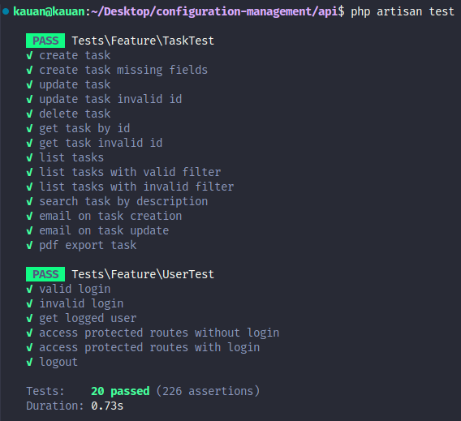

# Task 3 - Unit Tests

🔗 Link: [thorngym.com](http://thorngym.com/)

**NOTA:**

- 📧 Colocado meu e-mail e senha de acesso ao sistema, para que o professor possa acessar a aplicação e verificar as funcionalidades implementadas.
- 📤 Foi usado o e-mail real para poder enviar as notificações.

**Login:** `kauan.calheiro@universo.univates.br`  
**Senha:** `admin`

📂 **Repositório:** [GitHub - Task 3 Repository](https://github.com/KauanCalheiro/configuration-management.git)

---

## Melhorias no protótipo da Task 2

- [x] ✅ Completar o CRUD de tarefas:
  - [x] ➕ Criar nova tarefa
  - [x] 👀 Visualizar detalhes da tarefa
  - [x] ✏️ Editar tarefa existente
  - [x] 🗑️ Excluir tarefa
- [x] 🔐 Adicionar login ao sistema
- [x] 📬 Implementar envio de e-mail após criação ou atualização de uma tarefa
- [x] 🗂️ Adicionar filtros:
  - [x] 📅 Filtro por data
  - [x] 📌 Filtro por status
- [x] 📄 Implementar exportação das tarefas para PDF

---

## 📂 Testes de Tarefas (`TaskTest`)



### 1. ✅ **CREATE TASK**

Verifica se uma nova tarefa válida é criada corretamente

```php
public function test_create_task() {
    $this->authenticate();

    $taskData = Task::factory()->raw();
    $response = $this->postJson(self::TASKS_ENDPOINT, $taskData);

    $response->assertStatus(200)
        ->assertJsonStructure(self::JSON_STRUCTURE)
        ->assertJsonFragment([
            'success' => true,
            'message' => __('Request successfully')
        ])
        ->assertJsonFragment([
            'description' => $taskData['description'],
            'status' => $taskData['status'],
            'due_date' => $taskData['due_date'],
            'completed_at' => $taskData['completed_at'],
        ]);
}
```

**Explicação:** 
1. Geramos um conjunto de dados para uma nova tarefa usando o `Task::factory()->raw()`.
2. Enviamos uma requisição POST para o endpoint de tarefas com os dados gerados.
3. Verificamos se a resposta:
   - Tem o status 200 (OK).
   - Segue a estrutura JSON esperada.
   - Contém a mensagem de sucesso.
   - Inclui os dados da tarefa criada, como descrição, status, data de vencimento e data de conclusão.

### 2. ⚠️ **CREATE TASK MISSING FIELDS**

Verifica se o sistema rejeita adequadamente a criação de uma tarefa sem campos obrigatórios

```php
public function test_create_task_missing_fields() {
    $this->authenticate();

    $response = $this->postJson(self::TASKS_ENDPOINT, []);

    $response->assertStatus(422)
        ->assertJsonValidationErrors(['description', 'status']);
}
```

**Explicação:** 
1. Tentamos criar uma tarefa enviando um array vazio como dados.
2. Verificamos se:
   - A resposta tem o status 422 (Unprocessable Entity).
   - Contém erros de validação para os campos obrigatórios 'description' e 'status'.

### 3. ✅ **UPDATE TASK**

Verifica se uma tarefa existente pode ser atualizada corretamente

```php
public function test_update_task() {
    $this->authenticate();

    $task = Task::factory()->create();

    $response = $this->putJson(self::TASKS_ENDPOINT . "/{$task->id}", [
        'description' => 'Atualizada',
    ]);

    $response->assertStatus(200)->assertJson([
        'success' => true,
        'message' => __('Request successfully'),
        'payload' => [
            'id' => $task->id,
            'description' => 'Atualizada',
            'due_date' => $task->due_date ? $task->due_date->format('Y-m-d') : null,
            'completed_at' => $task->completed_at ? $task->completed_at->format('Y-m-d') : null,
            'created_at' => $task->created_at ? $task->created_at->format('Y-m-d') : null,
            'status' => $task->status,
        ],
        'count' => 1,
    ]);
}
```

**Explicação:** 
1. Criamos uma tarefa através do factory.
2. Enviamos uma requisição PUT para atualizar apenas a descrição da tarefa.
3. Verificamos se:
   - A resposta tem o status 200 (OK).
   - Contém a mensagem de sucesso.
   - A descrição foi atualizada para "Atualizada" enquanto os outros campos permanecem inalterados.

### 4. ❌ **UPDATE TASK INVALID ID**

Verifica se o sistema gerencia corretamente a tentativa de atualizar uma tarefa inexistente

```php
public function test_update_task_invalid_id() {
    $this->authenticate();

    $response = $this->putJson(self::TASKS_ENDPOINT . "/9999", [
        'description' => 'Atualizar',
    ]);

    $response->assertStatus(404)->assertJsonStructure([
        'message',
        'exception',
        'file',
        'line',
        'trace',
    ]);
}
```

**Explicação:** 
1. Tentamos atualizar uma tarefa com ID 9999 (presumivelmente inexistente).
2. Verificamos se:
   - A resposta tem o status 404 (Not Found).
   - Contém detalhes do erro na estrutura JSON apropriada.

### 5. 🗑️ **DELETE TASK**

Verifica se uma tarefa pode ser excluída (soft delete) corretamente

```php
public function test_delete_task() {
    $this->authenticate();

    $task = Task::factory()->create();

    $response = $this->deleteJson(self::TASKS_ENDPOINT . "/{$task->id}");

    $response->assertStatus(200)
        ->assertJsonStructure([
            'success',
            'message',
            'payload',
            'count',
        ]);
    $this->assertSoftDeleted('tasks', ['id' => $task->id]);
}
```

**Explicação:** 
1. Criamos uma tarefa através do factory.
2. Enviamos uma requisição DELETE para a tarefa criada.
3. Verificamos se:
   - A resposta tem o status 200 (OK).
   - A tarefa foi marcada como excluída, mas mantida no banco de dados (soft delete).

### 6. 🔎 **GET TASK BY ID**

Verifica se é possível buscar uma tarefa específica pelo seu ID

```php
public function test_get_task_by_id() {
    $this->authenticate();

    $task = Task::factory()->create();

    $response = $this->getJson(self::TASKS_ENDPOINT . "/{$task->id}");

    $response->assertStatus(200)
        ->assertJsonStructure(self::JSON_STRUCTURE);
}
```

**Explicação:** 
1. Criamos uma tarefa através do factory.
2. Enviamos uma requisição GET para buscar esta tarefa pelo ID.
3. Verificamos se:
   - A resposta tem o status 200 (OK).
   - A resposta segue a estrutura JSON esperada para uma única tarefa.

### 7. ❌ **GET TASK INVALID ID**

Verifica se o sistema retorna erro ao buscar uma tarefa com ID inexistente

```php
public function test_get_task_invalid_id() {
    $this->authenticate();

    $response = $this->getJson(self::TASKS_ENDPOINT . "/9999");

    $response->assertStatus(404);
}
```

**Explicação:** 
1. Tentamos buscar uma tarefa com ID 9999 (presumivelmente inexistente).
2. Verificamos se a resposta tem o status 404 (Not Found).

### 8. 📋 **LIST TASKS**

Verifica se a listagem de todas as tarefas funciona corretamente

```php
public function test_list_tasks() {
    $this->authenticate();

    Task::factory()->count(5)->create();

    $response = $this->getJson(self::TASKS_ENDPOINT);

    $response->assertStatus(200)
        ->assertJsonStructure(self::JSON_STRUCTURE_PAGINATED);
}
```

**Explicação:** 
1. Criamos 5 tarefas usando o factory.
2. Enviamos uma requisição GET para listar todas as tarefas.
3. Verificamos se:
   - A resposta tem o status 200 (OK).
   - A resposta segue a estrutura JSON paginada esperada.

### 9. ✅ **LIST TASKS WITH VALID FILTER**

Verifica se a filtragem de tarefas funciona corretamente com um filtro válido

```php
public function test_list_tasks_with_valid_filter() {
    $this->authenticate();

    Task::factory()->create(['status' => 'Parado']);
    Task::factory()->create(['status' => 'Concluída']);

    $response = $this->getJson(self::TASKS_ENDPOINT . '?filter[status]=Parado');

    $response->assertStatus(200)
        ->assertJsonStructure(self::JSON_STRUCTURE_PAGINATED)
        ->assertJsonFragment(['status' => 'Parado']);
}
```

**Explicação:** 
1. Criamos duas tarefas com status diferentes.
2. Enviamos uma requisição GET com filtro para buscar apenas tarefas com status "Parado".
3. Verificamos se:
   - A resposta tem o status 200 (OK).
   - A resposta segue a estrutura JSON paginada esperada.
   - A resposta contém apenas tarefas com status "Parado".

### 10. ⚠️ **LIST TASKS WITH INVALID FILTER**

Verifica como o sistema trata uma solicitação com filtro inválido

```php
public function test_list_tasks_with_invalid_filter() {
    $this->authenticate();

    $response = $this->getJson(self::TASKS_ENDPOINT . '?filter[invalid]=' . now()->addDays(2)->format('Y-m-d'));

    $response->assertStatus(500)
        ->assertJsonStructure([
            'success',
            'message',
            'errors',
            'trace',
        ])
        ->assertJsonFragment([
            'success' => false,
        ]);
}
```

**Explicação:** 
1. Enviamos uma requisição GET com um filtro inválido.
2. Verificamos se:
   - A resposta tem o status 500 (Internal Server Error).
   - A resposta contém detalhes do erro na estrutura JSON apropriada.
   - O campo "success" é igual a false.

### 11. 🔍 **SEARCH TASK BY DESCRIPTION**

Verifica se a busca de tarefas por descrição funciona corretamente

```php
public function test_search_task_by_description() {
    $this->authenticate();

    Task::factory()->create(['description' => 'Descrição específica']);

    $response = $this->getJson(self::TASKS_ENDPOINT . '?filter[search]=específica');

    $response->assertStatus(200)
        ->assertJsonStructure(self::JSON_STRUCTURE_PAGINATED)
        ->assertJsonFragment(['description' => 'Descrição específica']);
}
```

**Explicação:** 
1. Criamos uma tarefa com uma descrição específica.
2. Enviamos uma requisição GET com filtro de busca pela palavra "específica".
3. Verificamos se:
   - A resposta tem o status 200 (OK).
   - A resposta segue a estrutura JSON paginada esperada.
   - A resposta contém a tarefa com a descrição buscada.

### 12. 📤 **EMAIL ON TASK CREATION**

Verifica se um email é enviado após a criação de uma tarefa

```php
public function test_email_on_task_creation() {
    $this->authenticate();

    Mail::fake();

    $this->postJson(self::TASKS_ENDPOINT, Task::factory()->raw());

    Mail::assertSent(fn(CreatedTask $mail) => $mail->hasTo(auth()->user()->email) && $mail instanceof CreatedTask);
}
```

**Explicação:** 
1. Substituímos o serviço de email por um fake (mock).
2. Criamos uma nova tarefa via API.
3. Verificamos se:
   - Um email do tipo `CreatedTask` foi enviado.
   - O email foi enviado para o endereço do usuário autenticado.

### 13. ✉️ **EMAIL ON TASK UPDATE**

Verifica se um email é enviado após a atualização de uma tarefa

```php
public function test_email_on_task_update() {
    $this->authenticate();

    Mail::fake();

    $task = Task::factory()->create();

    $this->putJson(self::TASKS_ENDPOINT . "/{$task->id}", [
        'description' => 'Atualizar descrição',
    ]);

    Mail::assertSent(fn(UpdatedTask $mail) => $mail->hasTo(auth()->user()->email) && $mail instanceof UpdatedTask);
}
```

**Explicação:** 
1. Substituímos o serviço de email por um fake (mock).
2. Criamos uma tarefa e depois atualizamos sua descrição.
3. Verificamos se:
   - Um email do tipo `UpdatedTask` foi enviado.
   - O email foi enviado para o endereço do usuário autenticado.

### 14. 📄 **PDF EXPORT TASKS**

Verifica se a exportação de tarefas para PDF funciona corretamente

```php
public function test_pdf_export_task() {
    $this->authenticate();

    $task = Task::factory()->create();

    $endpoint = str_replace('{task}', $task->id, self::EXPORT_PDF_ENDPOINT);

    $response = $this->getJson($endpoint);

    $response->assertStatus(200);
    $this->assertEquals('application/pdf', $response->headers->get('Content-Type'));
    $this->assertStringStartsWith('%PDF', $response->content());
}
```

**Explicação:** 
1. Criamos uma tarefa usando o factory.
2. Enviamos uma requisição GET para exportar esta tarefa para PDF.
3. Verificamos se:
   - A resposta tem o status 200 (OK).
   - O tipo de conteúdo da resposta é "application/pdf".
   - O conteúdo do arquivo começa com "%PDF" (assinatura de documentos PDF).

## 🔒 Testes de Autenticação (`UserTest`)

### 15. 🔑 **VALID LOGIN**

Verifica se o login com credenciais corretas funciona adequadamente

```php
public function test_valid_login() {
    $user = User::factory()->create([
        'password' => bcrypt(self::PASSWORD),
    ]);

    $response = $this->postJson(self::LOGIN_ENDPOINT, [
        'email' => $user->email,
        'password' => self::PASSWORD,
    ]);

    $response->assertStatus(200)
        ->assertJsonStructure(['token']);
}
```

**Explicação:** 
1. Criamos um usuário com uma senha conhecida.
2. Tentamos fazer login com o email e senha corretos.
3. Verificamos se:
   - A resposta tem o status 200 (OK).
   - A resposta contém um token de autenticação.

### 16. ❌ **INVALID LOGIN**

Verifica se o sistema rejeita adequadamente tentativas de login com credenciais inválidas

```php
public function test_invalid_login() {
    $user = User::factory()->create([
        'password' => bcrypt(self::PASSWORD),
    ]);

    $response = $this->postJson(self::LOGIN_ENDPOINT, [
        'email' => $user->email,
        'password' => 'wrongpassword',
    ]);

    $response->assertStatus(401)
        ->assertJsonStructure([
            'success',
            'message',
            'errors',
            'trace',
        ])
        ->assertJsonFragment([
            'success' => false,
            'message' => __('Unauthorized'),
        ]);
}
```

**Explicação:** 
1. Criamos um usuário com uma senha conhecida.
2. Tentamos fazer login com o email correto, mas senha incorreta.
3. Verificamos se:
   - A resposta tem o status 401 (Unauthorized).
   - A resposta contém a mensagem apropriada de erro.
   - O campo "success" é igual a false.

### 17. 👤 **RETURN LOGGED USER**

Verifica se o sistema retorna corretamente os dados do usuário logado

```php
public function test_get_logged_user() {
    $user = User::factory()->create();

    $this->actingAs($user);

    $response = $this->getJson(self::LOGGED_USER_ENDPOINT);

    $response->assertStatus(200)
        ->assertJsonStructure([
            'success',
            'message',
            'payload' => [
                'id',
                'name',
                'email',
                'roles',
                'permissions',
            ],
            'count',
        ])
        ->assertJsonFragment([
            'success' => true,
            'message' => __('Request successfully'),
        ]);
}
```

**Explicação:** 
1. Criamos um usuário e autenticamos como ele.
2. Enviamos uma requisição GET para obter os dados do usuário logado.
3. Verificamos se:
   - A resposta tem o status 200 (OK).
   - A resposta contém os dados do usuário (id, nome, email, funções e permissões).
   - A mensagem de sucesso está presente.

### 18. 🚫 **ACCESS PROTECTED ROUTES WITHOUT LOGIN**

Verifica se rotas protegidas rejeitam acesso a usuários não autenticados

```php
public function test_access_protected_routes_without_login() {
    $response = $this->getJson(self::TASKS_ENDPOINT);

    $response->assertStatus(401)
        ->assertJsonFragment([
            'message' => 'Unauthenticated.',
        ]);
}
```

**Explicação:** 
1. Tentamos acessar a rota de tarefas sem estar autenticado.
2. Verificamos se:
   - A resposta tem o status 401 (Unauthorized).
   - A resposta contém a mensagem "Unauthenticated".

### 19. ✅ **ACCESS PROTECTED ROUTES WITH LOGIN**

Verifica se usuários autenticados podem acessar rotas protegidas

```php
public function test_access_protected_routes_with_login() {
    $user = User::factory()->create();
    $this->actingAs($user);

    $response = $this->getJson(self::TASKS_ENDPOINT);

    $response->assertStatus(200);
}
```

**Explicação:** 
1. Criamos um usuário e autenticamos como ele.
2. Tentamos acessar a rota de tarefas.
3. Verificamos se a resposta tem o status 200 (OK), indicando acesso permitido.

### 20. 🔓 **LOGOUT**

Verifica se o processo de logout funciona corretamente

```php
public function test_logout() {
    $user = User::factory()->create();
    $this->actingAs($user);

    $response = $this->postJson(self::LOGOUT_ENDPOINT);

    $response->assertStatus(200)
        ->assertJsonStructure([
            'success',
            'message',
            'payload',
            'count',
        ])
        ->assertJsonFragment([
            'success' => true,
            'message' => __('Successfully logged out'),
        ]);
}
```

**Explicação:** 
1. Criamos um usuário e autenticamos como ele.
2. Enviamos uma requisição POST para fazer logout.
3. Verificamos se:
   - A resposta tem o status 200 (OK).
   - A resposta contém a mensagem de sucesso de logout.

---

## Publicação

- [x] 🚀 Publicar a nova versão da aplicação na máquina virtual (VM)

<br>
<br>
<br>